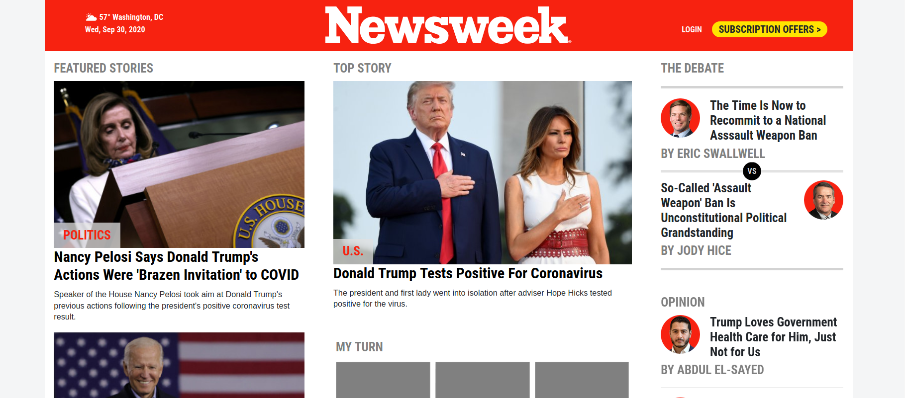

# Newsweek Clone

This project is a loosely cloned version of the Newsweek homepage using the Bootstrap 4 framework.

## Purpose

I completed this project as part of the full-stack web development curriculum at [theOdinProject](https://theodinproject.org), in order to learn and demonstrate my proficiency in the use of Bootstrap 4. The assignment is not to make an exact clone of the website, but to mimic its overall structure. Therefore, you may notice some images and text that is generic or repeating - this was done to save time and simply fill the space needed to create the overall structure.

## Built With

* HTML5
* CSS3
* Bootstrap 4

## Project Status

As of October 25, 2020, I have completed the assignment as intended. However, in the future I may revisit it, in order to make it a more perfect clone of the original, which is far above and beyond the intent of the assignment.

## About Me

* My name: Jay Conner
* My website: [CodingCop](https://codingcop.com)
* My Twitter: [@JayConner17](https://twitter.com/JayConner17)
* My LinkedIn: [LinkedIn](https://www.linkedin.com/in/jay-c-8000196)